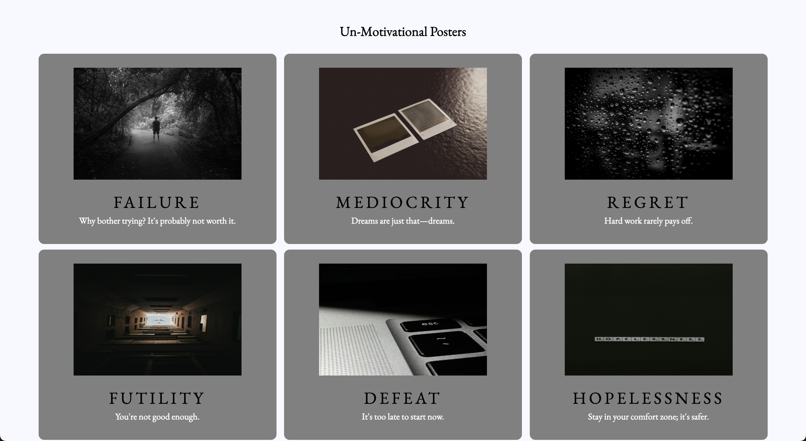
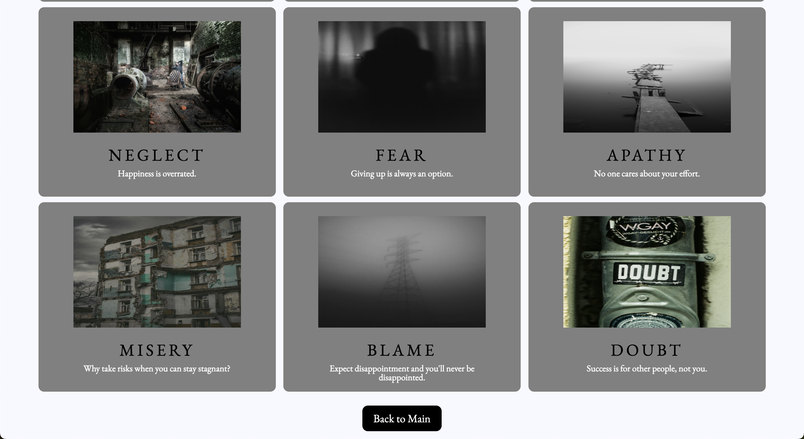

# Hang In There

## Set Up

1. Fork this repository
2. Clone down your new, forked repo
3. `cd` into the repository
4. Open it in your text editor
5. Add the instructors as collaborators on the repository

Project spec & rubric can be found [here](https://curriculum.turing.edu/module2/projects/hang_in_there/)

To view your project:

1. In your terminal, navigate to your project repo
2. Run the command `open index.html`
  
______________________________________________________  
# README Template  
Before turning this project in, erase this line and everything above it and fill in the info below.  
______________________________________________________  

# Hang in There  

### Abstract:
[//]: <> (Briefly describe what you built and its features. What problem is the app solving? How does this application solve that problem?)

### Installation Instructions:
[//]: <> (What steps does a person have to take to get your app cloned down and running?)

### Preview of App:
[//]: <> (Provide ONE gif or screenshot of your application - choose the "coolest" piece of functionality to show off. gifs preferred!)

### Context:
[//]: <> (Give some context for the project here. How long did you have to work on it? How far into the Turing program are you?)

### Contributors:
[//]: <> (Who worked on this application? Link to your GitHub. Consider also providing LinkedIn link)

### Learning Goals:
[//]: <> (What were the learning goals of this project? What tech did you work with?)

### Wins + Challenges:
[//]: <> (What are 2-3 wins you have from this project? What were some challenges you faced - and how did you get over them?)

### Iteration 0
- [x] When the page loads, we should see a poster with a randomly selected image, title, and quote
- [x] Every time the user clicks the Show Random Poster button, a new random poster is displayed.

### Iteration 1
- [x] When a user clicks the “Make Your Own Poster” button, we should see the form, and the main poster should be hidden
- [x] When a user clicks the “View Saved Posters” button, we should see the saved posters area, and the main poster should be hidden
- [x] When a user clicks the “Nevermind, take me back!” or “Back to Main” buttons, we should only see the main poster section

In summary: Be able to switch between the three views (main poster, form, and saved posters) on the correct button clicks

### Iteration 2
- [x] On the new poster form view, users should be able to fill out the three input fields and then hit the Show My Poster button
- [x] When the Show My Poster button is clicked, several things will happen:
  - [x] Use the values from the inputs to create a new, unique poster object (part of your data model)
  - [x] Save the submitted data into the respective arrays (image URL into the images array, etc - all part of your data model) so that future random posters can use the user-created data
  - [x] Change back to the main poster view (hiding the form view again)
  - [x] Use the new, unique poster object (part of your data model) to display the newly created poster image, title, and quote in the main view on the DOM

### Iteration 3
- [x] When a user clicks the “Save This Poster” button, the current main poster will be added to the savedPosters array.
- [x] If a user clicks the “Save This Poster” more than once on a single poster, it will still only be saved once (no duplicates)
- [x] When a user clicks the “Show Saved Posters” button, we should see the saved posters section
- [x] All the posters in the savedPosters array should be displayed in the saved posters grid section

### Iteration 4
- [x] From the saved posters view, if a user double clicks a saved poster, it will be deleted
  - HTML onclick attributes should not be used in any HTML code - all functionality should be through JavaScript.

### Iteration 5
- [x] On the main view, a user should see a newly added “Unmotivational Posters” button located after the existing buttons.
- [x] When a user clicks the “Unmotivational Posters” button, we should see an newly created Unmotivational Posters html section with:
  - [x] a title of “Unmotivational Posters”
  - [x] a div that will eventually hold the displayed posters (not actually a visible part of the page until posters are displayed)
  - [x] a “Back to Main” button
- [x] The main poster view should be hidden when viewing the Unmotivational Posters view
- [x] When a user clicks the “Back to Main” button, we should see the main poster view and the unmotivational posters view should be hidden.

The data you’ll need to complete this feature is in the dataset below.
<details>
<summary> Unmotivational Posters Data Set</summary>

```JS
let unmotivationalPosters = [
  {
    name: "FAILURE",
    description: "Why bother trying? It's probably not worth it.",
    price: 68.00,
    year: 2019,
    vintage: true,
    img_url: "./assets/failure.jpg",
  },
  {
    name: "MEDIOCRITY",
    description: "Dreams are just that—dreams.",
    price: 127.00,
    year: 2021,
    vintage: false,
    img_url: "./assets/mediocrity.jpg",
  },
  {
    name: "REGRET",
    description: "Hard work rarely pays off.",
    price: 89.00,
    year: 2018,
    vintage: true,
    img_url:  "./assets/regret.jpg",
  },
  {
    name: "FUTILITY",
    description: "You're not good enough.",
    price: 150.00,
    year: 2016,
    vintage: false,
    img_url:  "./assets/futility.jpg",
  },
  {
    name: "DEFEAT",
    description: "It's too late to start now.",
    price: 35.00,
    year: 2023,
    vintage: false,
    img_url:  "./assets/defeat.jpg",
  },
  {
    name: "HOPELESSNESS",
    description: "Stay in your comfort zone; it's safer.",
    price: 112.00,
    year: 2020,
    vintage: true,
    img_url: "./assets/hopelessness.jpg",
  },
  {
    name: "LAZINESS",
    description: "You can't change anything.",
    price: 25.00,
    year: 2022,
    vintage: false,
    img_url: "./assets/laziness.jpg",
  },
  {
    name: "PROCRASTINATION",
    description: "Better to avoid failure by not trying at all.",
    price: 48.00,
    year: 2017,
    vintage: true,
    img_url: "./assets/procrastination.jpg",
  },
  {
    name: "DESPAIR",
    description: "Let someone else do it; you’ll just mess it up.",
    price: 73.00,
    year: 2015,
    vintage: false,
    img_url: "./assets/despair.jpg",
  },
  {
    name: "NEGLECT",
    description: "Happiness is overrated.",
    price: 160.00,
    year: 2019,
    vintage: true,
    img_url: "./assets/neglect.jpg",
  },
  {
    name: "FEAR",
    description: "Giving up is always an option.",
    price: 91.00,
    year: 2014,
    vintage: false,
    img_url: "./assets/fear.jpg",
  },
  {
    name: "APATHY",
    description: "No one cares about your effort.",
    price: 110.00,
    year: 2016,
    vintage: true,
    img_url: "./assets/apathy.jpg",
  },
  {
    name: "MISERY",
    description: "Why take risks when you can stay stagnant?",
    price: 55.00,
    year: 2021,
    vintage: false,
    img_url: "./assets/misery.jpg",
  },
  {
    name: "BLAME",
    description: "Expect disappointment and you'll never be disappointed.",
    price: 39.00,
    year: 2017,
    vintage: true,
    img_url: "./assets/blame.jpg",
  },
  {
    name: "DOUBT",
    description: "Success is for other people, not you.",
    price: 140.00,
    year: 2020,
    vintage: false,
    img_url: "./assets/doubt.jpg",
  }
];
```
</details>

Let’s assume this data was pulled from a database. Each object has more data than what we need for creating and displaying posters. Our posters only have, and only need, an id, imageURL, title and quote. We’ll want to clean this data before we use it in our application.

Copy/paste the dataset into your main.js file after the existing arrays of images, titles and quotes.
- [x] Create a `cleanData()` function to go through each piece of this data and make it match the format we’ve been using for our poster data.
- [x] When a user visits the Unmotivational Posters view, we should see all 15 unmotivational posters displayed immediately. Use the cleaned data for this.
  - Don’t worry about the layout or styling yet

### Iteration 6
- [x] From the unmotivational posters view, if a user double clicks a poster, it will be deleted
  - Users should be able to double click anywhere on the poster to delete it - on the image, text or background.
  - HTML onclick attributes should not be used in any HTML code - all functionality should be through JavaScript.
  - The poster should be removed from your cleaned unmotivational posters data set and should no longer be displayed on the DOM.
  - If the user navigates away from the Unmotivational Posters view after deleting some posters, those posters should still be gone when they navigate back to that view.

### Iteration 7
- [x] Using CSS, make the styling/format of the new “Unmotivational Posters” button (on the main page) and the “Back to Main” button (on the Unmotivational Posters page) match the other buttons throughout the app.
- [x] Using CSS flexbox (not grid), control the layout of the unmotivational posters to match the comp provided here. Note: the number of posters you see in each row will flex based on the width of the screen, thats a good thing!
- [x] Using CSS, make the style and size of the unmotivational posters match the comp provided here. You’ll notice they should look slightly different than the saved posters.

<details>
<summary> Top of Unmotivational Posters View</summary>


</details>

<details>
<summary> Bottom of Unmotivational Posters View</summary>


</details>

### Optional Extensions
- [ ] Implement data validation and error handling into the form (disable button, provide error messages if data entered is not correct, etc)
- [ ] In the main poster view, allow users to click each piece of the poster (image, title, quote) to update just that piece with another random item from the appropriate array
- [ ] When a user single clicks a saved poster, create a modal to view it larger
- [ ] Allow users to drag and drop saved posters into whatever order they want them to appear
